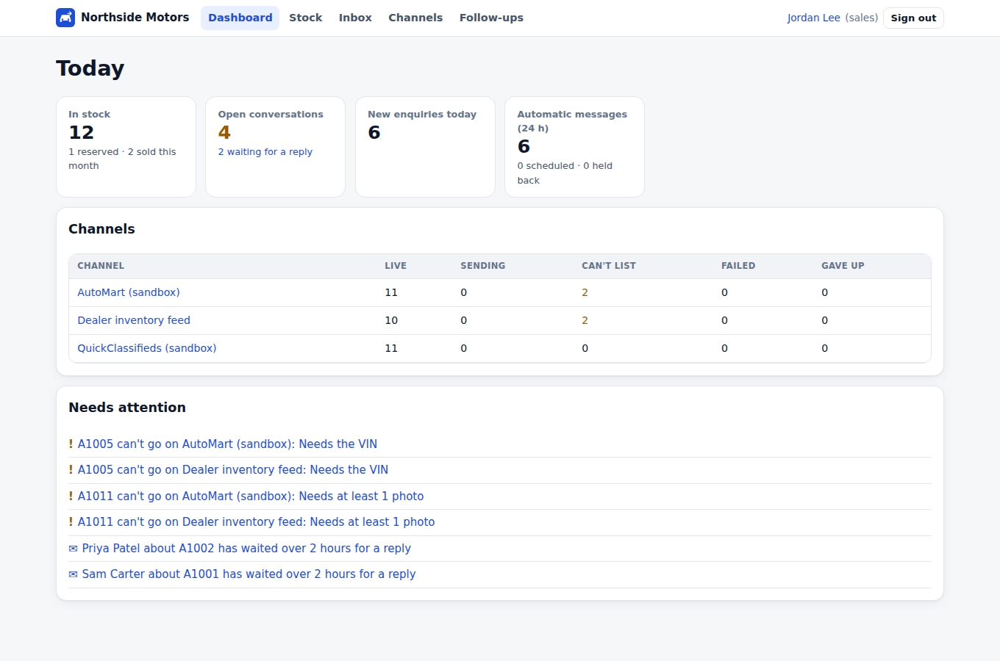
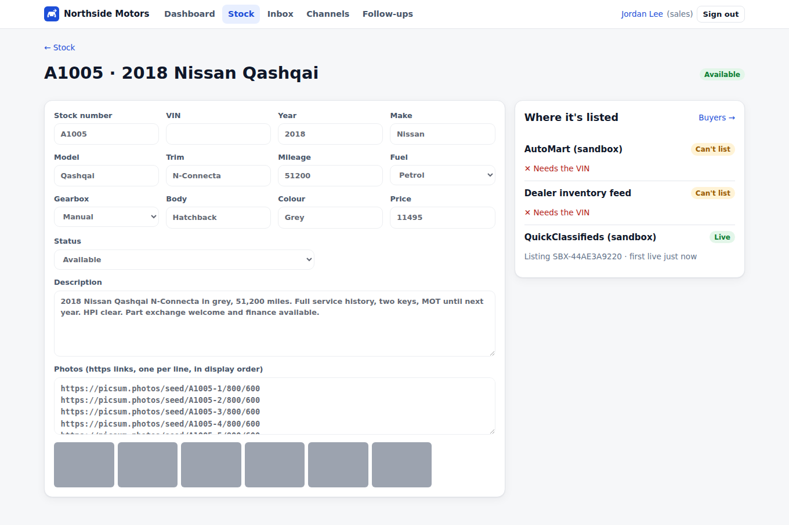
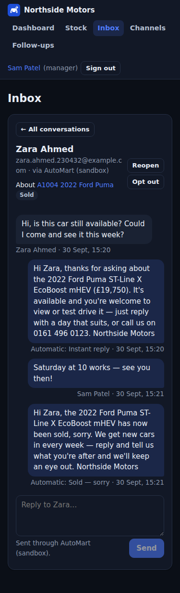
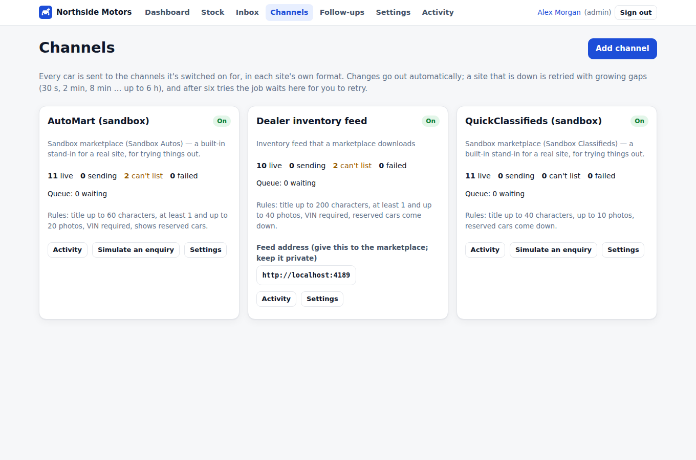

# Dealership Automation

Keep one stock list and let the software do the repetitive work. **Every car goes to several marketplaces in each site's own format and stays in sync.** Price changes, "reserved" and "sold" go out automatically, and a sold car is taken down everywhere. **Buyer enquiries from every site land in one inbox**, with follow-ups that are polite by design.



## What it does

**Publishing**
- Each channel has its own rules: title length, minimum and maximum photos, whether a VIN is required, whether "reserved" can be shown. A car that doesn't meet them is held back with the reason ("Needs the VIN"). Things that can be fixed automatically are, and flagged (a title shortened on a word boundary, extra photos dropped).
- Changes go through a queue in the database. Three quick price edits while a site is down go out **once, with the last price**, and an unchanged save sends nothing (each listing is compared by content hash).
- A site that fails is retried after 30 s, 2 min, 8 min, 32 min and about 2 h. After that the listing waits under "Needs attention" for a one-click retry. A car that was already live stays up with its last good version.
- Every request and answer is logged per channel.

**Channels you can use today, with no one else's API keys**
- **Inventory feed**: a CSV or XML file at a secret address. This is how AutoTrader, CarGurus, Motors and similar sites actually take dealer stock; give them the address.
- **Webhook**: signed JSON to any HTTPS endpoint (a partner's API, n8n, Zapier, Make or your own service). Every request carries an HMAC-SHA256 signature and a timestamp.
- **Sandbox marketplaces**: two built-in stand-ins with different rules and optional simulated failures, for trying everything end to end.

**Buyers**
- Enquiries arrive through a signed endpoint (or the sandboxes' "Simulate an enquiry"). Each is stored once however often a channel resends it.
- Follow-ups send an instant reply, one nudge after a buyer goes quiet, a price-drop notice to buyers still talking about the car, and a "sorry, it's sold" note. You write the templates, with a live preview.
- Always true, whatever the templates say:
  - a buyer who replies **STOP** gets nothing more, from people or automation;
  - nothing automatic goes out in quiet hours (it waits);
  - a buyer gets at most N automatic messages a week;
  - each follow-up goes at most once per conversation;
  - follow-ups about a car that has gone are cancelled;
  - a buyer who replies cancels any pending nudge.
- Messages typed by staff go through the same queue, so a channel that is down doesn't lose them.

| Car and its channels | Inbox (phone) | Channels |
| --- | --- | --- |
|  |  |  |

## Connecting a real marketplace

1. **If it takes a feed** (most UK and US car portals do), add a *feed* channel and send them its address. Nothing else is needed.
2. **If it has an API**, point a *webhook* channel at a small adapter that translates our signed events into its API, or at an n8n/Zapier flow. The events are:
   - `listing.created`, `listing.updated`, `listing.removed` and `message.send`, each with the full listing or message;
   - answer with `{ "externalId": "…" }` to tell us the site's id.
3. **To receive enquiries**, have the site (or your adapter) POST them to `/api/inbound/<channel id>`, signed with the channel's secret. The fields are `messageId`, `threadId`, `listingRef` (our stock number or the site's id), `buyer {name, email, phone}` and `text`.

Direct adapters for specific sites (AutoTrader Connect, eBay Motors, Facebook Marketplace partner APIs) need accounts and keys that only the dealer can obtain. They slot in beside the existing ones in `server/src/sync/adapters.ts`.

## Run it

```bash
cp .env.example .env            # set POSTGRES_PASSWORD, PUBLIC_URL, TIMEZONE
docker compose up -d --build
docker compose exec app node dist/cli/create-admin.js --email you@dealer.com --name "Your Name"
```

To try it with demo data instead: `docker compose exec -e ALLOW_DEMO_SEED=1 app node dist/cli/seed-demo.js`. Then log in as `admin@demo.local`, `manager@demo.local` or `sales@demo.local`. The password is `demo-password-1`.

Development (Node 22, PostgreSQL 16): `npm install`, set `DATABASE_URL`, then `npm run migrate && npm run seed:demo && npm run dev`. Operations (the worker, backups, secrets, https) are covered in [docs/OPERATIONS.md](docs/OPERATIONS.md).

## How it's built

- **Stack:** Fastify 5 and PostgreSQL; React 19 and TanStack Query. One Docker image; the background worker runs in the web process or on its own.
- **Queue:** jobs are claimed with `FOR UPDATE SKIP LOCKED`, and channel calls happen outside database transactions. A job stuck "running" is picked up again after 10 minutes, and creates are safe to repeat.
- **Security:**
  - Passwords are hashed with scrypt, and repeated failures lock the account.
  - Sessions are stored as hashes, with CSRF tokens and an origin check.
  - Helmet CSP is on.
  - Rate limits count signed-in users per session and everyone else per IP, so fake cookies don't earn a new allowance.
  - Inbound requests are HMAC-verified in constant time, with a replay window.
  - Feed secrets are compared in constant time.
  - CSV output is protected against formula injection.
- **Data rules enforced by the database:**
  - one waiting job per listing;
  - one car per VIN while in stock;
  - one follow-up per rule per conversation;
  - each inbound message stored once.

## Tests

- `npm test` runs:
  - unit tests for channel rules, templates, opt-out wording, and quiet hours (including across midnight and a clock change);
  - 18 API tests on PostgreSQL covering publishing rules, coalescing, retries and dead-lettering, signatures and replays, duplicates, STOP, price drops, sales, nudges, quiet hours and weekly limits, the feed, webhooks (5xx retried, 4xx not), permissions and rate limits.
- `npm run smoke` starts the real server with its worker and drives it in Chromium. It covers a price change reaching every channel, a channel switched off, a new car published, an enquiry answered automatically, a manual reply, a sale, an opted-out buyer, the feed, roles and phone layouts.
